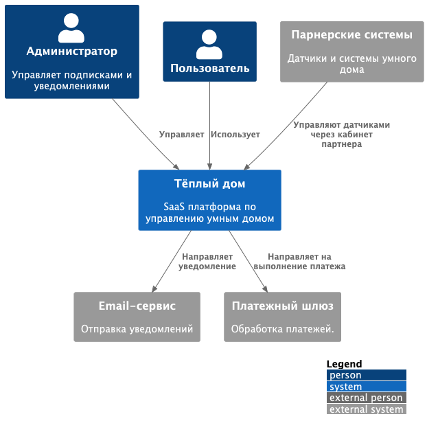
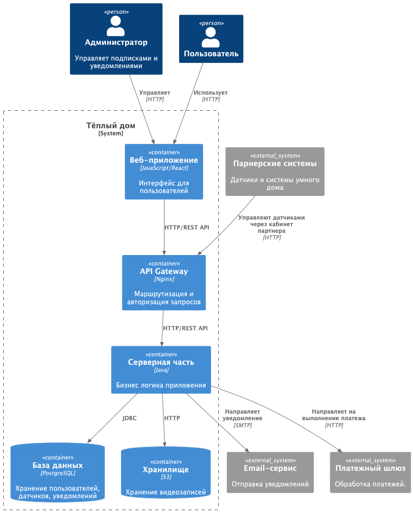
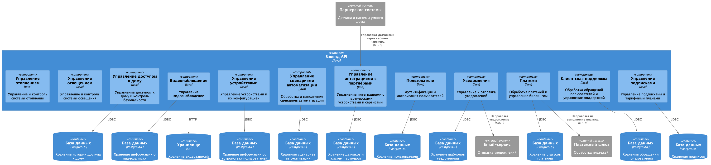
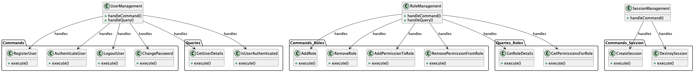
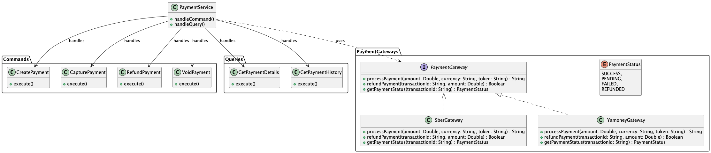
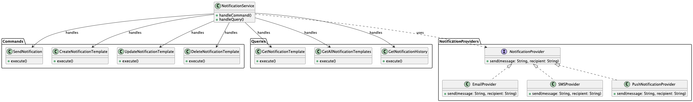
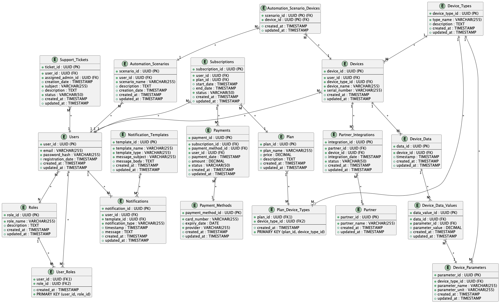

# Docs

В данном файле описан переход от монолитного приложения к микросервисной архитектуре в рамках задания на спринт.

# Задание 1. Анализ и планирование

<aside>
💡

Чтобы составить документ с описанием текущей архитектуры приложения, можно часть информации взять из описания компани и условия задания. Это нормально.

</aside>

### 1. Описание функциональности монолитного приложения

**Управление отоплением:**

- Пользователи могут управлять системой отоппления:  включать/выключать систему, устанавливать температуру , просматривать статус работы системы.
- Система поддерживает: cвязь с датчиками температуры и реле, обработку команд от пользователей на изменение режима отопления, хранение данных о настройках отопления, принятие информации от сервера.

**Мониторинг температуры:**

- Пользователи могут: устанавливать нужную температуру, следить за статусом темературы, выбирать режим корректировки "по погодным условиям"
- Система поддерживает: контроль температуры.

### 2. Анализ архитектуры монолитного приложения

- Язык программирования: Java
- База данных: PostgreSQL
- Архитектура: Монолитная, все компоненты системы (обработка запросов, бизнес-логика, работа с данными) находятся в рамках одного приложения.
- Взаимодействие: Синхронное, запросы обрабатываются последовательно.
- Масштабируемость: Ограничена, так как монолит сложно масштабировать по частям.
- Развёртывание: Требует остановки всего приложения.

---

### 3. Определение доменов и границы контекстов

AS IS:

**Домен:** Управление отоплением

 **Поддомен:** Управление работой системы отопления

**Контекст:**

*   Включение/выключение системы.

**Поддомен:** Мониторинг работы системы отопления

**Контекст:**

*   Управление температурой системы отопления.

TO BE:

**Домен:** Управление отоплением

**Контекст:** Предоставление функциональности для удаленного управления системой отопления, включая установку температуры, включение/выключение и мониторинг состояния. Интеграция с датчиками температуры и реле для автоматического контроля и регулирования.

**Домен:** Управление освещением

**Контекст:**  Предоставление функциональности для удаленного управления освещением в доме, включая включение/выключение, регулировку яркости.

**Домен:** Управление доступом к дому

**Контекст:**  Предоставление функциональности для удаленного управления автоматическими воротами (открытие/закрытие) и запирающими устройствами (замки). Обеспечение безопасности доступа к дому.

**Домен:** Видеонаблюдение

**Контекст:** Предоставление функциональности для удаленного просмотра видео с камер наблюдения, установленных в доме. Поддержка различных функций, таких как запись видео, обнаружение движения

**Домен:** Управление устройствами

**Контекст:** Предоставление общей инфраструктуры для подключения и управления различными устройствами умного дома. Регистрация устройств, управление их настройками, обновление прошивки (OTA), мониторинг состояния.

**Домен:** Управление сценариями автоматизации

**Контекст:** Предоставление функциональности для создания и управления сценариями автоматизации, которые позволяют автоматизировать выполнение различных задач в доме на основе определенных условий (например, времени суток, показаний датчиков, действий пользователя).

 **Домен:** Управление интеграциями с партнёрами

**Контекст:** Предоставление функциональности для интеграции с устройствами и сервисами партнеров.
 
**Домен:** Пользователи

**Контекст:** Регистрация и авторизация пользователей.

**Домен:** Уведомления

**Контекст:** Функционал по рассылке уведолмлений пользователям.

**Домен:** Платежи

**Контекст:** Функционал по оплате услуг.

**Домен:** Клиентская поддержка

**Контекст:** Прием обращений ЛТП от клиентов через чат.

**Домен:** Управление подписками

**Контекст:** Предоставление функциональности по подпискам на услуги платформы.

---

### **4. Проблемы монолитного решения**

- **Сложность расширения:** Добавление новых типов устройств требует практически полной переработки системы.
- **Высокая связанность:** Компоненты тесно связаны, что затрудняет разработку, интеграцию и масштабирование.
- **Проблемы с развертыванием:** Релизы требуют остановки всей системы.
- **Низкая отказоустойчивость:** Сбой одного компонента может привести к отказу всего приложения.
- **Ограниченное масштабирование:** Система поддерживает только вертикльное масштабирование.

---

### 5. Визуализация контекста системы — диаграмма С4

Исходный файл диаграммы расположен в `docs/context.plantuml`.

---

# Задание 2. Проектирование микросервисной архитектуры

**Диаграмма контейнеров (Containers)**

Исходный файл диаграммы расположен в `docs/containers.plantuml`.

**Диаграмма компонентов (Components)**

Исходный файл диаграммы расположен в `docs/components.plantuml`.

**Диаграмма кода (Code)**

- Пользователи

Исходный файл диаграммы расположен в `docs/auth_code_C4.plantuml`.
- Платежи

Исходный файл диаграммы расположен в `docs/payment_code_c4.plantuml`.
- Уведомления

Исходный файл диаграммы расположен в `docs/notification_code_c4.plantuml`.

# Задание 3. Разработка ER-диаграммы

Исходный файл диаграммы расположен в `docs/ER.plantuml`.

Четвёртое задание — дополнительное. Его можно сделать по желанию. Чтобы ревьюер быстрее проверил ваше решение, укажите, сделали вы это задание или нет. Для этого оставьте нужный эмодзи около заголовка задания:

✅ — вы выполнили задание.

❌ — вы пропустили задание.

# ❌  Задание 4. Создание и документирование API

### 1. Тип API

Укажите, какой тип API вы будете использовать для взаимодействия микросервисов. Объясните своё решение.

### 2. Документация API

Здесь приложите ссылки на документацию API для микросервисов, которые вы спроектировали в первой части проектной работы. Для документирования используйте Swagger/OpenAPI или AsyncAPI.